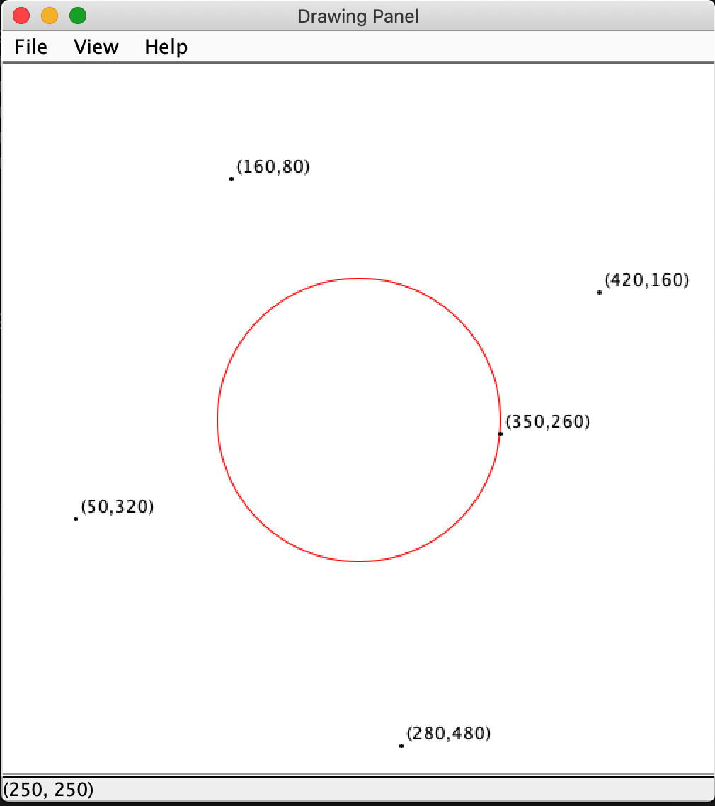

# EarthQuakeSimulator

EarthQuake is a Java Project, built to simulate/map the effects of an Earth Quake. \
Credit goes to the [AP Computer Science course at GKHS](https://www.bethelsd.org/Page/5198) & [CSE142 Winter 2016 at UW](https://courses.cs.washington.edu/courses/cse142/16wi/homework.shtml) \
Completed sometime during jounior year in highschool, 2017.

## Installation

```bash
git clone https://github.com/chrisbarnes2000/EarthQuake.git
cd EarthQuake
```

## Usage

```zsh
$ java EarthQuake.java 
How many Cities?
$ 5
with in 0,0 (top left) and 499, 499 (bottom right)
Enter the x and y cordinate for City 1: $ 350 260
Enter the x and y cordinate for City 2: $ 280 480
Enter the x and y cordinate for City 3: $ 160 80
Enter the x and y cordinate for City 4: $ 420 160
Enter the x and y cordinate for City 5: $ 50 320
What is the epicenter (x,y)? $ 250 250
What is the radius? $ 100

```



## Contributing

Pull requests are welcome. For major changes, please open an issue first to discuss what you would like to change.

Please make sure to update tests as appropriate.

### License [MIT](https://choosealicense.com/licenses/mit/)
